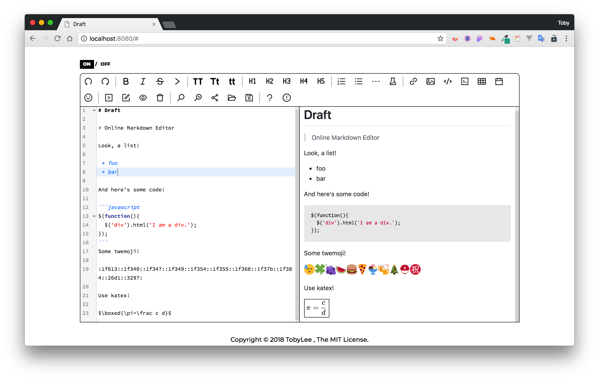

# Draft

> Online markdown editor

## Features

1. Support Standard Markdown and GFM ([GitHub Flavored Markdown](https://github.github.com/gfm/));
2. Import and Export to pdf\md\html;
3. Real-time Preview, Table generate, Code block, search\replace\go to line, Read only, Code syntax highlighting... ;
4. Support [TOC] (table of content);
5. OCR ([baidu-sdk](https://ai.baidu.com/tech/ocr/general)) and Image link generate ([SMMS](https://sm.ms/));
6. Support [KaTex](https://khan.github.io/KaTeX/function-support.html) and [Twemoji](https://twitter.github.io/twemoji/preview.html);
7. Keyboard Shortcuts;

## Usage

```shell

# 克隆到本地
$ git clone https://github.com/oddisland/Draft 

# 安装依赖
$ npm install

# 开启热更新服务器，TOC\OCR功能无法使用 -> localhost:8080
$ npm run build

# 打包压缩项目，并输出生产模式文件
$ npm run build:prod

# 打包压缩文件，启用node express，所有功能正常使用 -> localhost:8080
$ npm start

```

## Demo

[Let's Try Now!](http://138.128.201.158:8080/)



## Dependents 

- [CodeMirror](http://codemirror.net/)
- [jQuery](https://jquery.com/)
- [github-markdown.css](https://sindresorhus.com/github-markdown-css/)
- [twemoji](https://twemoji.twitter.com/)
- [notie](https://jaredreich.com/notie)
- [marked](https://marked.js.org/)
- [KaTeX](https://khan.github.io/KaTeX/)

## Todo

- [ ] Support Flowchart and Sequence Diagram;
- [ ] Auto save;

## License

The [MIT](https://github.com/oddisland/Draft/blob/master/LICENSE) License.